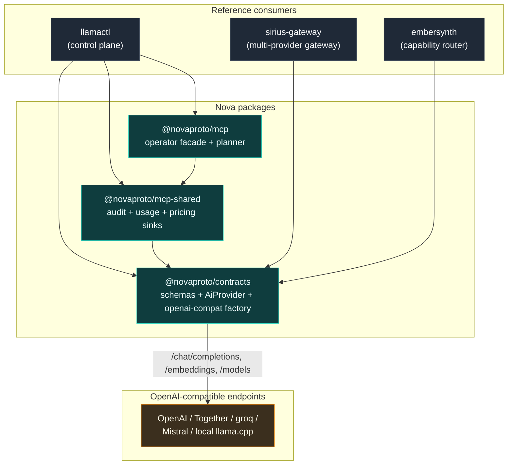

# Nova

[](./LICENSE)
[](https://www.npmjs.com/package/@novaproto/contracts)
[](https://www.npmjs.com/package/@novaproto/mcp-shared)
[](https://www.npmjs.com/package/@novaproto/mcp)
[](./tsconfig.base.json)
[](https://nodejs.org)

**One vocabulary for every AI provider. Schemas, adapters, and MCP scaffolding for the gateway you're already building.**

_The contracts every layer of an AI stack has to speak — chat, embeddings, models, streaming, health, usage, and pricing — written once, as Zod-validated types, plus a battle-tested OpenAI-compatible adapter factory and the MCP operator scaffolding everything else re-derives._

---

## What it is

Nova is the shared contract layer for multi-provider AI systems. It gives you one canonical, Zod-validated vocabulary for the shapes that cross every process boundary in an AI stack — chat requests and responses, streaming events, embeddings, model catalogs, provider health, usage records, and pricing — plus:

- a **provider factory** that turns any OpenAI-compatible endpoint into a typed `AiProvider` (chat, streaming, embeddings, model listing, health probing), and
- **MCP server scaffolding** — audit and usage sinks, a content-envelope helper, a pricing/cost layer, and a unified operator facade with a planner.

Implement `AiProvider` once; route, bill, observe, and proxy everywhere. Nova has no opinion about how you serve, route, or fail over — it ships the contracts, not the orchestrator.

Three packages, all published live on npm at **0.1.0**, MIT-licensed, ESM (`"type": "module"`):

| Package                 | Role                                                                                                                                                                                                                 |
| ----------------------- | -------------------------------------------------------------------------------------------------------------------------------------------------------------------------------------------------------------------- |
| `@novaproto/contracts`  | The SDK core. Zod schemas for chat / embeddings / models / health / stream / usage / pricing / retrieval, the `AiProvider` interface, and `createOpenAICompatProvider`. Zero runtime deps beyond `zod`.              |
| `@novaproto/mcp-shared` | Cross-cutting helpers for MCP servers — audit sink, content envelope, usage sink + reader, pricing loader + cost estimation. Transport-agnostic; plug into any MCP server.                                           |
| `@novaproto/mcp`        | Unified operator MCP facade — roll-up tools over sibling operator YAMLs + usage JSONL, a 1:1 downstream proxy, and `nova.operator.plan`, an intent-to-plan translator. A reference consumer of the two layers above. |

## Why

Pick any AI-gateway-ish problem — routing requests across providers, logging usage, fronting OpenAI-compat to a bespoke backend, writing an MCP tool that queries model health, teaching an LLM to fill out an operator runbook. Each one re-derives the same primitives:

- "What do a chat request and response look like on the wire?"
- "How do I stream content **and** tool calls?"
- "What shape is usage data in, and how do I price it?"
- "How do I expose this surface through MCP without re-inventing audit and content envelopes?"

Nova answers those once. **Adapter fixes land in one place**; schema changes propagate on the next install. The design rule is strict: _Nova does not know about its consumers_ — it depends on nothing downstream, so the dependency arrow only ever points toward it.

## How it fits together



`@novaproto/contracts` is the leaf — the only package with no internal Nova dependency. Everything else, including the reference consumers, depends inward. For the MCP facade's runtime topology (proxy + downstream boot + storage layout), see [the facade deep-dive in `AGENTS.md`](./AGENTS.md).

---

## `@novaproto/contracts` — the SDK core

Zero runtime dependencies beyond `zod`. Every type that crosses a process boundary, as a Zod schema with an inferred TypeScript type:

- **Chat wire types** — `UnifiedAiRequestSchema` / `UnifiedAiResponseSchema` (+ inferred `UnifiedAiRequest` / `UnifiedAiResponse`), `ChatMessageSchema`, `ContentBlockSchema` (a discriminated union of `TextBlockSchema`, `ImageBlockSchema`, `InputAudioBlockSchema`), `ToolSchema`, `ToolCallSchema`, `ToolCallDeltaSchema`, `ToolChoiceSchema`, `ResponseFormatSchema` (`text` / `json_object` / `json_schema`), `RoleSchema` (`system | user | assistant | tool | developer`), `FinishReasonSchema` (`stop | length | tool_calls | content_filter | error`), and `UsageSchema`.
- **Streaming events** — `UnifiedStreamEventSchema`, a discriminated union over `chunk` / `tool_call` / `error` / `done`, with `UnifiedStreamChunkSchema`, `StreamChoiceSchema`, and `StreamDeltaSchema` preserving tool-call deltas frame by frame.
- **Embeddings** — `UnifiedEmbeddingRequestSchema` / `UnifiedEmbeddingResponseSchema` and `EmbeddingRowSchema`. Input is a string | array | token-array union, with `encoding_format` and `dimensions`.
- **Models catalog** — `ModelInfoSchema`, `ModelListResponseSchema`, `ModelCapabilitySchema` (`chat | embeddings | reasoning | vision | audio | tools | json_mode | structured_output | long_context | code`), and `ModelCostSchema`.
- **Health** — `ProviderHealthSchema` and `ProviderHealthStateSchema` (`healthy | degraded | unhealthy | unknown`).
- **Usage record** — `UsageRecordSchema` (ts, provider, model, kind, prompt/completion/total tokens, latency, optional `request_id` / `estimated_cost_usd` / `user` / `route`), `UsageKindSchema` (`chat | embedding | responses`), and `MinimalUsageInput`. Privacy lock by design: it records **counts, not content**.
- **Pricing** — `ModelPricingSchema`, `ProviderPricingSchema`, and `PricingCatalog` (a `Map<string, ProviderPricing>`).
- **Retrieval (RAG)** — `SearchRequest` / `SearchResponse`, `StoreRequest` / `StoreResponse`, `DeleteRequest` / `DeleteResponse`, `ListCollectionsResponse`, `DocumentSchema`, `SearchResultSchema`, `CollectionInfoSchema`. Scores are cosine similarity normalized to `0..1`.
- **Runtime abstractions** (TypeScript interfaces, not Zod) — `AiProvider` (`createResponse`, optional `streamResponse`, `createEmbeddings`, `listModels`, `healthCheck`), `RetrievalProvider`, `ProviderFactory` / `ProviderFactoryInput`, and `ProviderRegistry`.

### The OpenAI-compat adapter factory

`createOpenAICompatProvider(opts: OpenAICompatOptions): AiProvider` turns any endpoint that speaks the OpenAI REST dialect — OpenAI itself, Together, groq, Mistral, a self-hosted llama-server — into a full `AiProvider`. Options:

| Field          | Required | Notes                                                                        |
| -------------- | -------- | ---------------------------------------------------------------------------- |
| `name`         | yes      | Provider name used in metadata + telemetry labels.                           |
| `baseUrl`      | yes      | e.g. `https://api.openai.com/v1`. Trailing slash tolerated.                  |
| `apiKey`       | yes      | Bearer token, sent as `Authorization: Bearer <key>`.                         |
| `displayName`  | no       | Human-friendly label.                                                        |
| `fetch`        | no       | `fetch` override for tests or runtime-specific TLS pinning.                  |
| `extraHeaders` | no       | Headers merged into every request (e.g. `OpenAI-Organization`).              |
| `healthPath`   | no       | Endpoint probed by `healthCheck`. Defaults to `/models`.                     |
| `onUsage`      | no       | Callback fired after each successful call (see usage logging example below). |

The factory covers non-streaming and SSE streaming (content **and** tool-call deltas), embeddings, `listModels`, and `healthCheck`; it fires `onUsage` after each successful call, and strips Nova-only `capabilities` / `providerOptions` before anything goes on the wire. It also exports the helpers `mergeRequestHeaders`, and the types `OpenAICompatUsageSnapshot` and `OpenAICompatOnUsage`. It is kept deliberately thin — no retry loop, no failover, no logging; those belong to the orchestrator that composes providers.

## `@novaproto/mcp-shared` — MCP server scaffolding

Depends on `@novaproto/contracts` and `yaml`. Thin utilities every MCP server wants:

- **Audit sink** — `appendAudit(opts: AuditOptions): AuditRecord` writes one JSONL line per invocation to `~/.llamactl/mcp/audit/<server>-<YYYY-MM-DD>.jsonl` (override with `LLAMACTL_MCP_AUDIT_DIR`). `defaultAuditDir(env?)` resolves the directory; types `AuditRecord` / `AuditOptions`.
- **Content envelope** — `toTextContent(payload): TextContentEnvelope` wraps a payload in the MCP `{ content: [{ type: 'text', text }] }` shape, keeping the `JSON.stringify` detail out of each handler.
- **Usage sink** — `appendUsage(opts): string` returns the file path it wrote (and **throws** if `record.provider` is missing); `appendUsageBackground(opts): void` is the fire-and-forget variant that swallows errors on hot paths. JSONL lands at `~/.llamactl/usage/<provider>-<YYYY-MM-DD>.jsonl` (override with `LLAMACTL_USAGE_DIR` or `DEV_STORAGE`). `defaultUsageDir(env?)`; type `UsageWriteOptions`.
- **Usage reader** — `readUsage(opts?): UsageReadResult` returns `{ records, filesScanned, malformedLines }`, with a day-boundary pre-filter and torn-write tolerance. Types `UsageReadOptions` (`dir` / `since` / `until` / `provider`) and `UsageReadResult`.
- **Pricing + cost** — `loadPricing(opts?): LoadPricingResult`, `estimateCostUsd(record, catalog): number | undefined`, `computeCost(pricing, promptTokens, completionTokens): number`, `findModelPricing(provider, model, catalog)`, and `defaultPricingDir(env?)`. Pricing YAML lives under `LLAMACTL_PRICING_DIR` / `DEV_STORAGE`; malformed YAML is skipped, never thrown. Types `LoadPricingOptions` / `LoadPricingResult`.

Drop into any MCP server — your own, or `@novaproto/mcp` — without pulling framework dependencies.

## `@novaproto/mcp` — unified operator MCP facade

Optional but useful: a stdio MCP server that rolls up the YAMLs a multi-provider AI deployment typically writes, proxies sibling MCP servers 1:1, and surfaces everything through a single endpoint. Depends on `@modelcontextprotocol/sdk` (1.29.0), `@novaproto/contracts`, `@novaproto/mcp-shared`, `yaml`, and `zod`.

### Native tools

| Tool                     | Purpose                                                                                                                                                                                                                                       |
| ------------------------ | --------------------------------------------------------------------------------------------------------------------------------------------------------------------------------------------------------------------------------------------- |
| `nova.ops.overview`      | Reads the three operator YAMLs and returns agents + gateways + providers + profiles + synthetic models. Missing files become empty sections.                                                                                                  |
| `nova.ops.healthcheck`   | GET-probes each gateway and sirius provider `baseUrl`; fails soft per probe. Input `timeoutMs` (default 1500, max 30000).                                                                                                                     |
| `nova.ops.cost.snapshot` | Aggregates usage JSONL over the last `days` (default 7, max 90) into per-provider and per-(provider, model) roll-ups, joining pricing when present. Inputs `disablePricing` / `pricingDir` / `dir`.                                           |
| `nova.operator.plan`     | Translates a natural-language `goal` (+ optional `context`) into a `PlanSchema`-validated tool-call plan, allowlist-filtered. The default executor is a stub — bind your own LLM executor for real planning.                                  |
| `nova.models.list`       | Aggregates `llamactl.catalog.list` + `sirius.models.list` + `embersynth.synthetic.list` in parallel, merges by the fixed priority `["llamactl", "sirius", "embersynth"]`, dedupes by id (recording `alsoAvailableIn`), and reports `partial`. |

### The planner

Four pure pieces, exported from the package root:

- **Schema** — `PlanSchema` and `PlanStepSchema` (with `Plan` / `PlanStep` / `PlannerToolDescriptor` / `ToolSafetyTier` = `read | mutation-dry-run-safe | mutation-destructive`). A 20-step hard cap; each step requires an `annotation`.
- **Allowlist** — `filterTools` + `DEFAULT_ALLOWLIST` (type `AllowlistConfig`). Deny wins over allow, the destructive tier needs `allowDestructive`, and an empty allow list fails closed. `DEFAULT_ALLOWLIST` allows `llamactl.* | sirius.* | embersynth.* | nova.*` and denies `sirius.providers.deregister`, `llamactl.infra.uninstall`, `llamactl.workload.delete`.
- **Prompt** — `buildPlannerPrompt(opts): BuildPlannerPromptResult` emits the deterministic system + user messages and the `submit_plan` function schema.
- **Executor** — the `PlannerExecutor` interface, the canned `stubPlannerExecutor`, and the `runPlanner(opts): Promise<RunPlannerResult>` composer (allowlist → prompt → executor → `PlanSchema` parse, returning a discriminated result). To bind a real model, `createLlmExecutor(opts: CreateLlmExecutorOptions): PlannerExecutor` wraps any `AiProvider` and forces the `submit_plan` tool via `tool_choice`.

The package also exports `buildNovaMcpServer(opts?: BuildNovaMcpServerOptions): McpServer` (opts `name` / `version` / `plannerExecutor` / `plannerAllowlist` / `plannerTools`), the cost-snapshot helper `computeCostSnapshot(opts?): CostSnapshot` (types `CostGroup` / `CostSnapshot` / `CostSnapshotOptions`), and the default-path resolvers `defaultKubeconfigPath` / `defaultSiriusProvidersPath` / `defaultEmbersynthConfigPath`.

### Honest boundaries

These are deliberate, not gaps:

- **The default planner executor is a stub** — it returns a canned plan until you bind an LLM via `createLlmExecutor`.
- **The facade proxy snapshots downstream tools at boot only** — there is no hot reload; restart the facade to pick up downstream tool changes.

---

## Install

All three packages are live on npm under the `@novaproto` scope.

```bash
npm install @novaproto/contracts @novaproto/mcp-shared @novaproto/mcp
# or: bun add @novaproto/contracts @novaproto/mcp-shared @novaproto/mcp
```

```json
{
  "dependencies": {
    "@novaproto/contracts": "^0.1.0",
    "@novaproto/mcp-shared": "^0.1.0",
    "@novaproto/mcp": "^0.1.0"
  }
}
```

**Node-portable.** Each package builds to `dist/src/*.js` + `.d.ts` via `tsc --build`, with `main` / `types` pointing at the compiled JS — so consumers run on plain Node. Bun is the development and CI runtime only; the published artifacts run anywhere Node does.

Inside this monorepo the three packages reference each other with `workspace:*`; `bun publish` (and `npm publish`) rewrite that to the concrete published version at release time, so consumers always pull a real semver range, never a workspace or file specifier.

## Examples

### Build a provider adapter

```ts
import { createOpenAICompatProvider } from "@novaproto/contracts";

const provider = createOpenAICompatProvider({
  name: "together",
  baseUrl: "https://api.together.xyz/v1",
  apiKey: process.env.TOGETHER_API_KEY!,
});

const res = await provider.createResponse({
  model: "meta-llama/Llama-3.3-70B-Instruct",
  messages: [{ role: "user", content: "hello" }],
});

console.log(res.choices[0].message.content, res.latencyMs, res.provider);
```

### Log usage via the adapter's `onUsage` hook

```ts
import { createOpenAICompatProvider } from "@novaproto/contracts";
import { appendUsageBackground } from "@novaproto/mcp-shared";

const provider = createOpenAICompatProvider({
  name: "openai",
  baseUrl: "https://api.openai.com/v1",
  apiKey: process.env.OPENAI_API_KEY!,
  onUsage: (s) =>
    queueMicrotask(() =>
      appendUsageBackground({
        record: { ...s, ts: new Date().toISOString() },
      }),
    ),
});
```

`OpenAICompatUsageSnapshot` carries `provider` / `model` / `kind` / `prompt_tokens` / `completion_tokens` / `total_tokens` / `latency_ms` — exactly the writable fields of a `UsageRecord` minus `ts`, which you stamp on the way to the sink.

### MCP server with audit + content envelope

```ts
import { McpServer } from "@modelcontextprotocol/sdk/server/mcp.js";
import { appendAudit, toTextContent } from "@novaproto/mcp-shared";
import { z } from "zod";

const server = new McpServer({ name: "my-service", version: "0.1.0" });

server.registerTool(
  "my.service.status",
  { title: "Service status", inputSchema: { verbose: z.boolean().default(false) } },
  (input) => {
    const status = { ok: true, verbose: input.verbose };
    appendAudit({ server: "my-service", tool: "my.service.status", input });
    return toTextContent(status);
  },
);
```

### Planner with a real LLM executor

```ts
import { createOpenAICompatProvider } from "@novaproto/contracts";
import { buildNovaMcpServer, createLlmExecutor } from "@novaproto/mcp";

const provider = createOpenAICompatProvider({
  name: "openai",
  baseUrl: "https://api.openai.com/v1",
  apiKey: process.env.OPENAI_API_KEY!,
});

const server = buildNovaMcpServer({
  plannerExecutor: createLlmExecutor({ provider, model: "gpt-4o-mini" }),
});
```

For the pure path without a server, `runPlanner({ goal, context, tools, allowlist, executor })` returns a discriminated `RunPlannerResult` — on failure, `reason` is one of `executor-failed` / `plan-shape-invalid` / `empty-goal` / `disallowed-tool`.

### Cost snapshot without a server

```ts
import { computeCostSnapshot } from "@novaproto/mcp";

const snap = computeCostSnapshot({ days: 7 });
// snap.byProvider, snap.byModel, snap.totalEstimatedCostUsd
```

## Running nova-mcp

The `@novaproto/mcp` package ships a `nova-mcp` binary — a stdio MCP facade you wire into Claude Desktop or any MCP client. On boot it runs `loadConfig` → `bootAll` → `mountProxyTools` (1:1 proxy, first-wins on name collisions, native tool names seeded so they always win) → `registerUnifiedTools`, then serves over a stdio transport with clean SIGINT / SIGTERM shutdown. The facade reads its downstream config from `~/.llamactl/nova-mcp.yaml` (override with `NOVA_MCP_CONFIG`); each downstream is `stdio` or `http`, with `${VAR}` env interpolation. The full facade reference — config schema, boot/passthrough sequence, the snapshot-at-boot contract, and what to avoid — lives in [`AGENTS.md`](./AGENTS.md).

```bash
bun install
bun packages/mcp/bin/nova-mcp.ts
```

## Toolchain

A strict, hard-gated toolchain. Every command runs on Bun (pinned in CI):

```bash
bun run build              # tsc --build -> dist + .d.ts for every package
bun run typecheck:strict   # tsc --noEmit over the whole tree
bun run lint               # no-cross-package-relative guard + eslint --max-warnings=0 + strict typecheck
bun test                   # all packages
```

`bun run lint` is zero-tolerance: ESLint runs with `--max-warnings=0`, a custom `no-cross-package-relative` guard forbids reaching across package boundaries with relative imports, and the strict typecheck is folded in.

CI (`.github/workflows/check.yml`) re-runs the full gate as a hard block on every pull request and push to `main`. The test step routes through `scripts/bun-test-gate.ts`, which gates on reported pass/fail counts and tolerates a Bun NAPI-teardown panic (exit 133) **only** when zero tests failed.

Releases (`.github/workflows/release.yml`) publish the `@novaproto/*` packages to npm in dependency order — **contracts → mcp-shared → mcp**. The default run is a dry-run pack; a `v*` tag or a manual dispatch with `dry_run=false` publishes for real.

## Reference consumers

Real-world apps built on Nova. Nova depends on none of them — the arrow points inward.

- [llamactl](https://github.com/frozename/llamactl) — single-operator control plane for llama.cpp fleets. Uses every Nova package.
- [sirius-gateway](https://github.com/frozename/sirius-gateway) — multi-provider AI gateway with OpenAI-compatible routes. Adapters delegate to `@novaproto/contracts`.
- [embersynth](https://github.com/frozename/embersynth) — capability-based distributed AI orchestration runtime. Its OpenAI-compatible adapter delegates to Nova's provider factory.

## License

MIT. See [LICENSE](./LICENSE).
